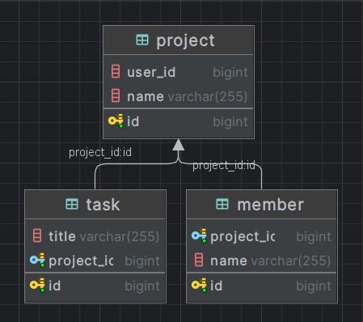

---

# **MoA: Moments of Awareness API**

이 API는 앱에서 관리되는 데이터인 Project, Member, Task를 관리할 수 있도록 설계된 백엔드입니다. 주요 기능으로는 프로젝트 생성, 수정, 조회뿐만 아니라 작업(Task) 및 멤버(Member)에 대한 CRUD(생성, 읽기, 수정, 삭제) 기능을 제공합니다.

---

## **목차**
1. [📖 기술](#기술)
2. [📁 Project 기능](#project-기능)
   - [**Project 생성**](#project-생성)
   - [**Project 전체 조회**](#project-전체-조회)
   - [**Project 이름 수정 기능**](#project-이름-수정-기능)
3. [👥 Member 기능](#member-기능)
   - [**Member 생성/추가 기능**](#member-생성추가-기능)
   - [**Member들 불러오기**](#member들-불러오기)
4. [📃 Task 기능](#task-기능)
   - [**Task 생성/추가 기능**](#task-생성추가-기능)
   - [**Task 모두 불러오기**](#task-모두-불러오기)
   - [**Task 이름 수정 기능**](#task-이름-수정-기능)
   - [**Task 삭제 기능**](#task-삭제-기능)
5. [📊 ERD](#erd)


---

## 📖 **기술**

**Backend:**  
- **Framework & Language**: Spring Boot 3.x with Java 17  
- **Database**: MySQL  
- **Build Tool**: Maven  

**Development Tools:**  
- **API Documentation**: Swagger  
- **IDE**: IntelliJ IDEA  
- **API Testing**: Postman  

---

## **1. 📁 Project 기능**

### **Project 생성**
- **설명**: 프론트엔드에서 `name`만 전달하면 백엔드에서 `userId`와 `projectId`를 자동 생성하는 기능

| **메서드** | **요청 URL**    |
|------------|-----------------|
| POST       | `/projects`     |

#### **요청 파라미터**
| **파라미터**   | **타입** | **필수 여부** | **파라미터 이름** |
|----------------|----------|---------------|-------------------|
| `@RequestBody` | String   | 필수          | name              |

---

### **Project 전체 조회**
- **설명**: 생성된 모든 Projets를 리스트 형식으로 불러오는 기능

| **메서드** | **요청 URL**    |
|------------|-----------------|
| GET        | `/projects`     |

#### **응답 예시**
```json
[
    {
        "id": 1,
        "name": "프로젝트 이름",
        "userId": "고정된 UUID"
    },
    {
        "id": 2,
        "name": "다른 프로젝트 이름",
        "userId": "고정된 UUID"
    }
]
```

---

### **Project 이름 수정 기능**
- **설명**: 특정 `projectId`를 가진 프로젝트의 이름 수정하는 기능

| **메서드** | **요청 URL**               |
|------------|---------------------------|
| PATCH      | `/projects/{projectId}`   |

#### **요청 파라미터**
| **파라미터**    | **타입** | **필수 여부** | **파라미터 이름** |
|-----------------|----------|---------------|-------------------|
| `PathVariable`  | Long     | 필수          | projectId         |
| `@RequestBody`  | String   | 필수          | name              |

---

## **2. 👥 Member 기능**

### **Member 생성/추가 기능**
- **설명**: 특정 프로젝트에 멤버를 추가하는 기능

| **메서드** | **요청 URL**                     |
|------------|---------------------------------|
| POST       | `/projects/{projectId}/members` |

#### **요청 파라미터**
| **파라미터**   | **타입** | **필수 여부** | **파라미터 이름** |
|----------------|----------|---------------|-------------------|
| `PathVariable` | Long     | 필수          | projectId         |
| `@RequestParam`| String   | 필수          | name              |

---

### **Member들 불러오기**
- **설명**: 특정 프로젝트에 속한 모든 멤버를 조회하는 기능

| **메서드** | **요청 URL**                     |
|------------|---------------------------------|
| GET        | `/projects/{projectId}/members` |

#### **응답 예시**
```json
[
    {
        "id": 5,
        "name": "팀원1"
    },
    {
        "id": 6,
        "name": "팀원2"
    }
]
```

---

## **3. 📃 Task 기능**

### **Task 생성/추가 기능**
- **설명**: 특정 프로젝트에 할 일을 추가하는 기능

| **메서드** | **요청 URL**              |
|------------|---------------------------|
| POST       | `/tasks/{projectId}`      |

#### **요청 파라미터**
| **파라미터**   | **타입** | **필수 여부** | **파라미터 이름** |
|----------------|----------|---------------|-------------------|
| `PathVariable` | Long     | 필수          | projectId         |
| `@RequestBody` | String   | 필수          | title             |

---

### **Task 모두 불러오기**
- **설명**: 특정 프로젝트에 속한 모든 할 일을 조회하는 기능

| **메서드** | **요청 URL**              |
|------------|---------------------------|
| GET        | `/tasks/{projectId}`      |

#### **응답 예시**
```json
[
    {
        "id": 1,
        "title": "이거부터해~",
        "projectId": 1
    },
    {
        "id": 2,
        "title": "다음에는 이거양~",
        "projectId": 1
    },
    {
        "id": 3,
        "title": "우오 이것도 해~",
        "projectId": 1
    }
]
```

---

### **Task 이름 수정 기능**
- **설명**: 특정 `taskId`를 가진 할 일의 이름을 수정하는 기능

| **메서드** | **요청 URL**              |
|------------|---------------------------|
| PATCH      | `/tasks/{taskId}`         |

#### **요청 파라미터**
| **파라미터**    | **타입** | **필수 여부** | **파라미터 이름** |
|-----------------|----------|---------------|-------------------|
| `PathVariable`  | Long     | 필수          | taskId            |
| `@RequestBody`  | String   | 필수          | title             |

---

### **Task 삭제 기능**
- **설명**: 특정 `taskId`를 가진 할 일을 삭제하는 기능

| **메서드** | **요청 URL**              |
|------------|---------------------------|
| DELETE     | `/tasks/{taskId}`         |

#### **요청 파라미터**
| **파라미터**    | **타입** | **필수 여부** | **파라미터 이름** |
|-----------------|----------|---------------|-------------------|
| `PathVariable`  | Long     | 필수          | taskId            |

---

## 📊 **ERD**

### **ERD 구조**



### **연관 관계**
- **Project**는 여러 **Members** 를 받음
- **Project**는 여러 **Tasks**를 받음

---
